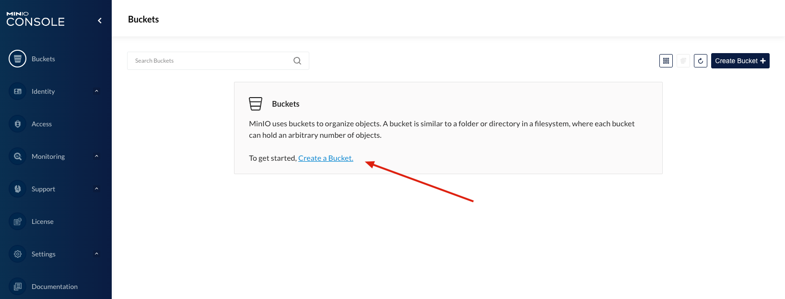

# 如何启动项目

### 1.安装docker 和 docker-compose

#### 由于使用的操作系统不同，安装docker的方式也不同，所以请自行Google docker安装教程

### 2.安装中间件

``` shell
#进入到middleware-install 文件夹
cd doc/middleware-install
# 启动容器 安装中间件
docker-compose up -d 
```
#### 2.1 Elasticsearch 安装ik分词器
http://localhost:9200/ 有内容代表运行成功

http://localhost:9200/_cat/indices?v 查看索引
```shell
# 进入到elasticsearch容器
docker exec -it bridge-to-china-elasticsearch /bin/bash
# 在线安装ik分词器
./bin/elasticsearch-plugin install https://github.com/medcl/elasticsearch-analysis-ik/releases/download/v7.17.3/elasticsearch-analysis-ik-7.17.3.zip
# 退出容器
exit
# 重启容器
docker restart bridge-to-china-elasticsearch
```
#### 2.2 RabbitMQ 安装管理插件
#### http://localhost:15672 有界面代表运行成功
```shell
# 进入到rabbitmq容器
docker exec -it bridge-to-china-rabbitmq /bin/bash
# 安装管理插件
rabbitmq-plugins enable rabbitmq_management
# 退出容器
exit
# 重启容器
docker restart bridge-to-china-rabbitmq
```
#### 2.3 Minio 添加存储桶
#### http://localhost:9000
#### 因为需要设置了一个存储桶，所以需要登录到minio的管理页面，进行设置
账号：admin
密码：12345678
登录后会看到如下界面

创建一个存储桶，名为`bridge-to-china

创建成功后，需要调整仓库的权限，要不然会看不到图片


#### 2.4 Nacos 添加配置
#### http://localhost:8848/nacos
#### 因为需要设置了一个配置，所以需要登录到nacos的管理页面，进行设置
账号：nacos
密码：nacos
登录后会看到如下界面

接下来，我们需要添加一个dev 的namespace

然后我们需要导入配置文件，点击配置列表，选择dev的namespace，然后点击导入配置

在弹出的窗口中，选择导入文件，选择doc/nacos/nacos-config.zip


导入成功后，我们就可以看到配置文件了


#### 2.5 数据库密码更改
因为我相信大家都不会使用默认密码，所以需要更改数据库的密码
选择datasource.yaml文件，修改数据库的密码

在箭头所指的位置，修改为你的数据库密码，然后保存即可


### 3.启动项目
接下来就可以启动项目了，启动项目之前，需要先启动中间件，还有需要导入数据库文件

### 项目环境配置
可以更改项目环境来启动项目


在最外层的pom.xml文件中，可以更改项目的环境，目前有dev和prod两种环境，如果需要更多环境，可以自行添加


# 以下是各个中间件的默认账号密码
```shell
Minio
   Acc: admin
   Pwd: 12345678
   
 Nacos
    Acc: nacos
    Pwd: nacos
 
 Redis
    Acc: 无
    Pwd: 123456
    
 RabbitMQ
    Acc: admin
    Pwd: 123456
```


